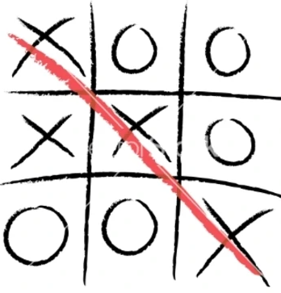

# Crater-Cross

## Demo
A live demo can be found .

***

## Table of Contents
1. [UXD Considerations](#uxd-considerations)
    * [User](#user)
    * [Crater-Cross](#crater-cross)
    * [Wireframes](#wireframes)
    * [User Stories](#user-stories)
    * [CSS Framework](#css-framework)
    * [Colour Palette](#colour-palette)
    * [Typography](#typography)
    * [Icon Graphics](#icon-graphics) 
2. [Technologies Applied](#technologies-applied)
    * [Languages](#languages)
    * [Libraries](#libraries)
    * [Tools](#tools)
    * [Hosting](#hosting)
3. [Features](#features)
    * [Features Left to Implement](#features-left-to-implement) 
4. [Tests](#tests)
5. [Deployment](#deployment)
    * [Local Deployment](#local-deployment)
6. [Credits](#credits)
    * [Content](#content)
    * [Media](#media)
    * [Acknowledgements](#acknowledgements)

## UXD Considerations
### Ambition

#### User

#### Crater-Cross

## Wireframes

## User Stories
> I need an game that is quick and provides a win, lose or draw outcome  

> The game should allow 2 players to compete 

> The identification of the 2 players should be made visible

> The game should feature on a simple 3x3 grid

> Each player must be assigned either an 'X' or 'O' to keep track of their moves

### CSS Framework
Bootstrap was the chosen framework for styling my project. I used the bootstrap grid extensively to support responsiveness on mobile, tablet and desktop devices.  

### Colour Palette

### Typography

### Icon Graphics

## Technologies Applied
### Languages
•	[HTML5](https://html.spec.whatwg.org/multipage/) used as the markup language

•	[CSS3](https://www.w3.org/Style/CSS/) used to style the HTML

•	[React.js](https://reactjs.org/) used as declararive views make the code more predictable, component logic enables rich data to be passed through the app and keep state out of the DOM.

### Libraries
•	[Font Awesome](https://fontawesome.com/) v5.8.2 to provide the icon set

•	[Google Fonts](https://fonts.google.com/) provided the fonts used throughout the project

•	[jQuery](https://jquery.com/) is used to manipulate the DOM, for example buttons, and showing / hiding elements

### Tools
•	[AWS Cloud9](https://aws.amazon.com/cloud9/) a cloud-based integrated development environment (IDE) that lets you write, run, and debug your code with just a browser.

•	[Git](https://git-scm.com/) is a free and open source distributed version control system designed to handle everything from small to very large projects with speed and efficiency.

•	[GitHub](https://github.com/) is a code hosting platform for version control and collaboration. It lets you and others work together on projects from anywhere.

•	[Balsamiq](https://balsamiq.com/) is a small graphical tool to sketch out user interfaces, for websites and web / desktop / mobile applications and used to visualise my project through mock-up design.

### Hosting
•	[GitHub Pages](https://pages.github.com/) is used to host the deployed application - 'Crater-Cross'

## Features

### Features Left to Implement

## Testing
Test analysis and reporting can be viewed in a separate [TESTS.md](https://github.com/Spagettileg/Crater-Cross/blob/master/TESTS.md) file.

## Deployment

### Local Deployment

## Credits

### Content

### Media

Image used for README.md introduction sourced from [Board Games Galore Wikia](https://board-games-galore.fandom.com/wiki/Tic-tac-toe)

### Acknowledgements

**This is for educational use.** 